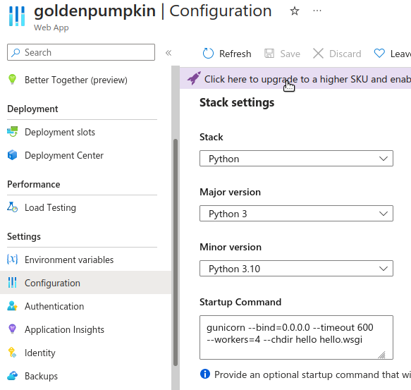

# My Notes


## Using form template

13 Jul, Sat

Following the tutorial to create a comment form with template.

### Location of form template

When trying to use form template, I encountered the problem of the location of the template. The error encountered was **TemplateNotFound**. I tried many different locations.

The first location was `\templates\` where I have been putting the various html files. However this did not work for the form template. Finally the location that work is `\content\templates\form_template.html`. If I put the `form_template.html` in `\content\templates\content\form_template.html`, it would not work.

### Placement of button

The `<form>`, `` and `<button>` should be put in the parent form html. The form template should contains just the from styling.


## To use Azure Email Backend

Install the package [django-azure-communication-email](https://pypi.org/project/django-azure-communication-email/)


This is how to specify the **EMAIL_BACKEND** in the **settings.py**.
```
EMAIL_BACKEND = 'django_azure_communication_email.EmailBackend'
AZURE_KEY_CREDENTIAL = config("AZURE_COMM_KEY", "")
AZURE_COMMUNICATION_ENDPOINT = config("AZURE_COMM_ENDPOINT", "")
DEFAULT_FROM_EMAIL="<Your-email-like-DoNotReply@example.com>"
```

## To create new app in this repo

Go to the outer **hello** directory, where the **manage.py** is located. Start a new app in this directory. The outer **hello** is the **project directory**.

```
cd hello\
python manage.py startapp home
python manage.py check
```

## Location for templates

Location for **templates** is usually in the same level as the **manage.py** directory. Whether to place the **templates** in the **project** or the **app** directory is a matter of choice. Placing all `html` in the project directory is the approach in *Django in Action*.

# Useful info for deployment to Azure web apps

## Add a startup command

This is following the suggestion in [Example startup commands](https://learn.microsoft.com/en-us/azure/app-service/configure-language-python#example-startup-commands)

```
# <module-path> is the relative path to the folder that contains the module
# that contains wsgi.py; <module> is the name of the folder containing wsgi.py.
gunicorn --bind=0.0.0.0 --timeout 600 --workers=4 --chdir <module_path> <module>.wsgi
gunicorn --bind=0.0.0.0 --timeout 600 --workers=4 --chdir hello hello.wsgi
```



## ALLOWED_HOSTS warning

Ignore warning like that shown below. Actually when this warning is showing, it means the app deployment is running successfully.

```
2024-06-28T09:57:44.8286114Z django.core.exceptions.DisallowedHost: Invalid HTTP_HOST header: '169.254.129.7:8000'. You may need to add '169.254.129.7' to ALLOWED_HOSTS.
```

In `DEBUG` mode, set   `ALLOWED_HOSTS=localhost'.

## Key vault usage

In the environment, specify the key like this:

`@Microsoft.KeyVault(VaultName:<my_vault_name>;SecretName:<my_secret_name_in_the_vault>)

## Environment variables

```
ALLOWED_HOSTS=<my_app_name>.azurewebsites.net
DEBUG=true
DISABLE_COLLECTSTATIC=false
PRE_BUILD_COMMAND=echo Pre-build command
POST_BUILD_COMMAND=echo Post-build command
SCM_DO_BUILD_DURING_DEPLOYMENT=true
SECRET_KEY=@Microsoft.KeyVault(VaultName:<my_vault_name>;SecretName:<my_secret_name_in_the_vault>)
SQL_DRIVER=ODBC Driver 18 for SQL Server
SQL_SERVER=<my_sql_server_name>.database.windows.net
SQL_NAME=<my_sql_database_name>
SQL_USER=<sql_username>
SQL_PASSWORD=<sql_password>
WEBSITE_HTTPLOGGING_RETENTION_DAYS=3
```

## To use this template

Change the name `hello` to the name of a new app.

Reference repository for future:
- `green-engine`: The Django template from Codespaces.
- `purple-potato`: Creating REST API with Python, Django and Azure SQL. The sample from Microsoft Learn.
- `singing_cricket`: This repository combines the features from both the Django template and the REST API examples.

## Notes on create a new repository

```
echo "# singing_cricket" >> README.md
git init
git add README.md
git commit -m "first commit"
git branch -M main
git remote add origin https://github.com/liewchooichin/singing_cricket.git
git push -u origin main
```

